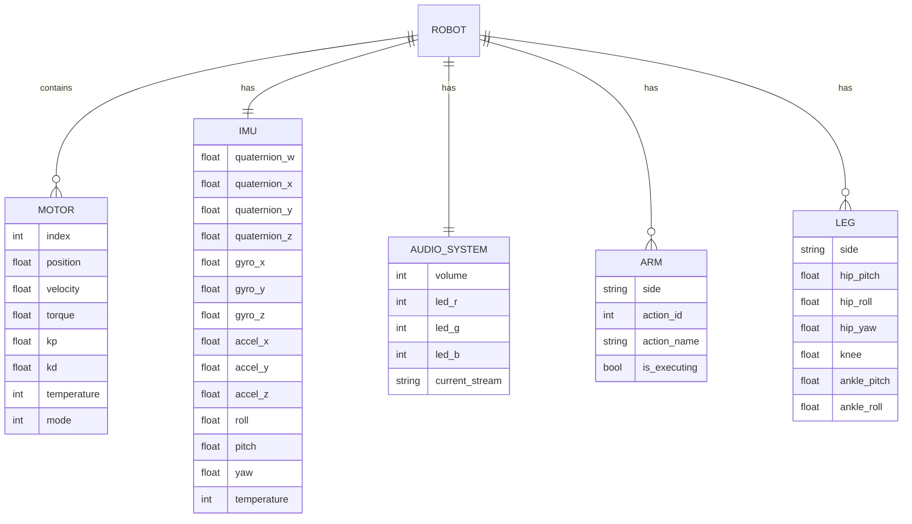

# Documento de Arquitetura Técnica - SDK Python para Robô G1 da Unitree

## 1. Arquitetura do Sistema


## 2. Descrição das Tecnologias

- **Frontend**: Python 3.x + unitree_sdk2py
- **Comunicação**: CycloneDDS (Data Distribution Service)
- **Serialização**: IDL (Interface Definition Language)
- **Dependências**: numpy, opencv-python, cyclonedx
- **Plataforma**: Linux (Ubuntu recomendado)

## 3. Definições de Rotas/Módulos

| Módulo | Propósito |
|--------|----------|
| `unitree_sdk2py.core` | Gerenciamento de canais DDS e comunicação base |
| `unitree_sdk2py.rpc` | Sistema de chamadas de procedimento remoto |
| `unitree_sdk2py.g1.loco` | Controle de locomoção do robô G1 |
| `unitree_sdk2py.g1.arm` | Controle de ações dos braços do G1 |
| `unitree_sdk2py.g1.audio` | Sistema de áudio e controle de LEDs |
| `unitree_sdk2py.idl` | Definições de tipos de dados IDL |
| `unitree_sdk2py.utils` | Utilitários (CRC, threads, etc.) |

## 4. Definições de API

### 4.1 APIs de Alto Nível

#### Locomoção (LocoClient)
```python
class LocoClient(Client):
    def SetFsmId(self, fsm_id: int) -> Tuple[int, Any]
    def SetBalanceMode(self, balance_mode: int) -> Tuple[int, Any]
    def SetStandHeight(self, height: float) -> Tuple[int, Any]
    def SetVelocity(self, vx: float, vy: float, vyaw: float) -> Tuple[int, Any]
    def SetTaskId(self, task_id: int) -> Tuple[int, Any]
    
    # Métodos de conveniência
    def Damp(self) -> Tuple[int, Any]
    def Start(self) -> Tuple[int, Any]
    def StopMove(self) -> Tuple[int, Any]
    def HighStand(self) -> Tuple[int, Any]
    def LowStand(self) -> Tuple[int, Any]
    def Move(self, vx: float, vy: float, vyaw: float, continuous: bool = False) -> Tuple[int, Any]
    def BalanceStand(self) -> Tuple[int, Any]
    def WaveHand(self, turn_flag: bool = False) -> Tuple[int, Any]
    def ShakeHand(self) -> Tuple[int, Any]
```

#### Controle de Braços (G1ArmActionClient)
```python
class G1ArmActionClient(Client):
    def ExecuteAction(self, action_id: int) -> Tuple[int, Any]
    def GetActionList(self) -> Tuple[int, List[str]]
```

#### Sistema de Áudio (AudioClient)
```python
class AudioClient(Client):
    def TtsMaker(self, text: str, speaker_id: int) -> Tuple[int, Any]
    def GetVolume(self) -> Tuple[int, int]
    def SetVolume(self, volume: int) -> Tuple[int, Any]
    def LedControl(self, R: int, G: int, B: int) -> Tuple[int, Any]
    def PlayStream(self, app: str, stream: str, data: bytes) -> Tuple[int, Any]
    def PlayStop(self, app_name: str) -> Tuple[int, Any]
```

### 4.2 APIs de Baixo Nível

#### Estruturas de Comando
```python
class LowCmd_:
    version: List[int]                    # Versão do protocolo
    mode_pr: int                         # Modo PR/AB
    mode_machine: int                    # Modo da máquina
    motor_cmd: List[MotorCmd_]           # Comandos dos motores (35 elementos)
    reserve: List[int]                   # Campos reservados
    crc: int                            # Checksum CRC

class MotorCmd_:
    mode: int                           # Modo do motor (0: desabilitado, 1: habilitado)
    q: float                           # Posição desejada (radianos)
    dq: float                          # Velocidade desejada (rad/s)
    tau: float                         # Torque desejado (N⋅m)
    kp: float                          # Ganho proporcional
    kd: float                          # Ganho derivativo
    reserve: List[int]                 # Campos reservados
```

#### Estruturas de Estado
```python
class LowState_:
    version: List[int]                   # Versão do protocolo
    mode_pr: int                        # Modo atual PR/AB
    mode_machine: int                   # Modo atual da máquina
    tick: int                          # Contador de tempo
    imu_state: IMUState_               # Estado do IMU
    motor_state: List[MotorState_]     # Estado dos motores (35 elementos)
    wireless_remote: List[int]         # Dados do controle remoto
    reserve: List[int]                 # Campos reservados
    crc: int                          # Checksum CRC

class MotorState_:
    mode: int                          # Modo atual do motor
    q: float                          # Posição atual (radianos)
    dq: float                         # Velocidade atual (rad/s)
    ddq: float                        # Aceleração atual (rad/s²)
    tau: float                        # Torque atual (N⋅m)
    temperature: int                  # Temperatura do motor (°C)
    lost: int                         # Status de comunicação
    reserve: List[int]                # Campos reservados

class IMUState_:
    quat: List[float]                 # Quaternion [w, x, y, z]
    gyro: List[float]                 # Giroscópio [x, y, z] (rad/s)
    accel: List[float]                # Acelerômetro [x, y, z] (m/s²)
    rpy: List[float]                  # Roll, Pitch, Yaw (radianos)
    temperature: int                  # Temperatura do IMU (°C)
```

## 5. Arquitetura de Comunicação


## 6. Modelo de Dados

### 6.1 Diagrama de Entidades



### 6.2 Definições de Dados (IDL)

#### Estruturas de Motor
```idl
struct MotorCmd_ {
    uint8 mode;
    float q;
    float dq;
    float tau;
    float kp;
    float kd;
    uint32 reserve[3];
};

struct MotorState_ {
    uint8 mode;
    float q;
    float dq;
    float ddq;
    float tau;
    int8 temperature;
    uint8 lost;
    uint32 reserve[2];
};
```

#### Estruturas de IMU
```idl
struct IMUState_ {
    float quat[4];        // w, x, y, z
    float gyro[3];        // x, y, z (rad/s)
    float accel[3];       // x, y, z (m/s²)
    float rpy[3];         // roll, pitch, yaw (rad)
    int8 temperature;     // °C
};
```

#### Comandos de Alto Nível
```idl
struct LocoCmd_ {
    uint32 fsm_id;
    uint32 balance_mode;
    float stand_height;
    float velocity[3];    // vx, vy, vyaw
    uint32 task_id;
};

struct ArmActionCmd_ {
    uint32 action_id;
    uint32 duration;
};

struct AudioCmd_ {
    string text;
    uint32 speaker_id;
    uint32 volume;
    uint8 led_rgb[3];
};
```

## 7. Configuração de Rede

### 7.1 Requisitos de Rede
- **Interface**: Ethernet Gigabit
- **Protocolo**: DDS sobre UDP/IP
- **Latência**: < 2ms para comandos de baixo nível
- **Largura de banda**: ~10 Mbps para operação completa

### 7.2 Configuração DDS
```python
# Inicialização do Channel Factory
ChannelFactoryInitialize(domain_id=0, network_interface="enp2s0")

# Configuração de QoS para baixa latência
qos_profile = {
    "reliability": "RELIABLE",
    "durability": "VOLATILE",
    "history": "KEEP_LAST",
    "depth": 1
}
```

### 7.3 Tópicos DDS

| Tópico | Tipo | Direção | Frequência | Descrição |
|--------|------|---------|------------|----------|
| `rt/lowcmd` | LowCmd_ | PC → Robô | 500 Hz | Comandos de baixo nível |
| `rt/lowstate` | LowState_ | Robô → PC | 500 Hz | Estado de baixo nível |
| `rt/api_request` | ApiRequest_ | PC → Robô | Variável | Requisições de API |
| `rt/api_response` | ApiResponse_ | Robô → PC | Variável | Respostas de API |
| `rt/loco_cmd` | LocoCmd_ | PC → Robô | 100 Hz | Comandos de locomoção |
| `rt/arm_cmd` | ArmCmd_ | PC → Robô | 50 Hz | Comandos de braço |
| `rt/audio_cmd` | AudioCmd_ | PC → Robô | 10 Hz | Comandos de áudio |

## 8. Gerenciamento de Estado

### 8.1 Máquina de Estados do Robô


### 8.2 Estados de Controle

| Estado | ID | Descrição | Transições Permitidas |
|--------|----|-----------|-----------------------|
| Idle | 0 | Estado inicial | → Damping |
| Damping | 1 | Amortecimento ativo | → Standing, → Idle |
| Standing | 2 | Em pé estável | → Walking, → Squatting, → Sitting, → Gesture |
| Walking | 3 | Caminhando | → Standing |
| Squatting | 4 | Agachado | → Standing |
| Sitting | 5 | Sentado | → Standing |
| Gesture | 6 | Executando gesto | → Standing |

## 9. Tratamento de Erros

### 9.1 Códigos de Erro

| Código | Nome | Descrição | Ação Recomendada |
|--------|------|-----------|------------------|
| 0 | SUCCESS | Operação bem-sucedida | Continuar |
| -1 | TIMEOUT | Timeout de comunicação | Verificar rede |
| -2 | INVALID_PARAM | Parâmetro inválido | Verificar valores |
| -3 | NOT_READY | Sistema não pronto | Aguardar inicialização |
| -4 | HARDWARE_ERROR | Erro de hardware | Verificar robô |
| -5 | PERMISSION_DENIED | Permissão negada | Verificar modo |

### 9.2 Estratégias de Recuperação

```python
def safe_execute_command(client, command, *args, max_retries=3):
    """Executa comando com retry automático"""
    for attempt in range(max_retries):
        try:
            code, result = command(*args)
            if code == 0:  # SUCCESS
                return code, result
            elif code == -1:  # TIMEOUT
                time.sleep(0.1 * (attempt + 1))  # Backoff exponencial
                continue
            else:
                # Erro não recuperável
                return code, result
        except Exception as e:
            if attempt == max_retries - 1:
                raise e
            time.sleep(0.1 * (attempt + 1))
    
    return -1, None  # Falha após todas as tentativas
```

## 10. Otimizações de Performance

### 10.1 Configurações de Thread
```python
# Configuração de thread para baixo nível
control_thread = RecurrentThread(
    interval=0.002,  # 2ms = 500Hz
    target=low_level_control_loop,
    name="LowLevelControl"
)

# Configuração de thread para alto nível
api_thread = RecurrentThread(
    interval=0.01,   # 10ms = 100Hz
    target=high_level_api_loop,
    name="HighLevelAPI"
)
```

### 10.2 Otimizações de Rede
```python
# Configuração de buffer para reduzir latência
socket_config = {
    "SO_RCVBUF": 1024 * 1024,  # 1MB receive buffer
    "SO_SNDBUF": 1024 * 1024,  # 1MB send buffer
    "SO_REUSEADDR": True,
    "TCP_NODELAY": True        # Disable Nagle's algorithm
}
```

### 10.3 Gerenciamento de Memória
```python
# Pool de objetos para evitar alocações frequentes
class CommandPool:
    def __init__(self, size=100):
        self.pool = [LowCmd_() for _ in range(size)]
        self.available = list(range(size))
        self.lock = threading.Lock()
    
    def get_command(self):
        with self.lock:
            if self.available:
                idx = self.available.pop()
                return self.pool[idx]
            else:
                return LowCmd_()  # Fallback
    
    def return_command(self, cmd, idx):
        with self.lock:
            # Reset command
            cmd.Clear()
            self.available.append(idx)
```

## 11. Segurança e Validação

### 11.1 Validação de Parâmetros
```python
def validate_joint_limits(joint_index, position):
    """Valida limites das juntas"""
    limits = {
        G1JointIndex.LeftKnee: (-0.1, 2.8),
        G1JointIndex.RightKnee: (-0.1, 2.8),
        # ... outros limites
    }
    
    if joint_index in limits:
        min_pos, max_pos = limits[joint_index]
        return min_pos <= position <= max_pos
    return True

def validate_velocity(vx, vy, vyaw):
    """Valida limites de velocidade"""
    return (abs(vx) <= 0.5 and 
            abs(vy) <= 0.5 and 
            abs(vyaw) <= 0.5)
```

### 11.2 Sistema de Watchdog
```python
class SafetyWatchdog:
    def __init__(self, timeout=1.0):
        self.timeout = timeout
        self.last_heartbeat = time.time()
        self.emergency_stop = False
    
    def heartbeat(self):
        self.last_heartbeat = time.time()
    
    def check_safety(self):
        if time.time() - self.last_heartbeat > self.timeout:
            self.emergency_stop = True
            return False
        return True
    
    def emergency_stop_robot(self, loco_client):
        """Para o robô em caso de emergência"""
        loco_client.Damp()
        loco_client.StopMove()
```

Esta arquitetura técnica fornece uma base sólida para o desenvolvimento de aplicações robóticas com o G1, garantindo performance, segurança e manutenibilidade.